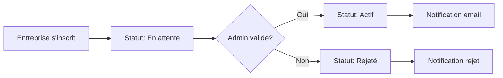
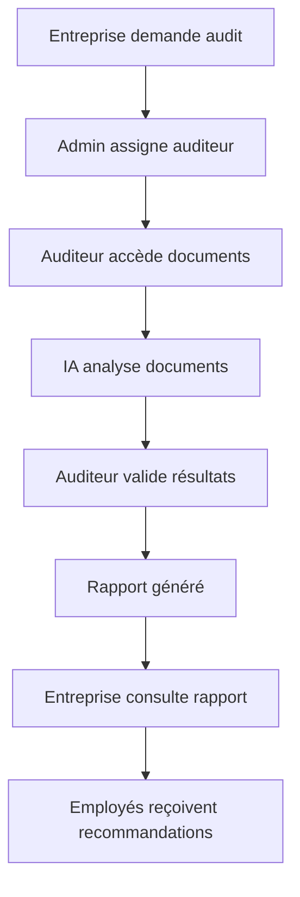

# Acteurs du Système - Auditeur Interne

## 👥 Les 4 Acteurs Principaux

### 1. 🔧 ADMIN (Administrateur Plateforme)

**Rôle** : Administrateur Plateforme

**Responsabilités** :
- Valider/rejeter inscriptions entreprises
- Approuver documents uploadés
- Gérer activation des comptes
- Superviser les audits IA

**Entité Symfony** : `User` avec `ROLE_ADMIN`

**Fonctionnalités spécifiques** :
- Dashboard admin complet
- Gestion des utilisateurs (activation/désactivation)
- Validation des inscriptions entreprises
- Approbation des documents sensibles
- Supervision des audits IA
- Logs d'activité système

---

### 2. 🏢 ENTREPRISE (Client RH, DRH)

**Rôle** : Client (Responsable RH, DRH)

**Responsabilités** :
- S'inscrire sur la plateforme
- Uploader documents (certifications, rapports RH)
- Consulter rapports d'audit IA
- Gérer profil entreprise

**Entité Symfony** : `Entreprise` (avec compte utilisateur associé)

**Fonctionnalités spécifiques** :
- Inscription et validation par admin
- Upload de documents (certifications, rapports RH, politiques)
- Consultation des rapports d'audit générés par IA
- Historique des audits
- Gestion du profil entreprise
- Tableau de bord avec statistiques

---

### 3. 🎓 AUDITEUR (Psychologue / Expert RH)

**Rôle** : Psychologue / Expert RH

**Responsabilités** :
- Accéder aux documents entreprises
- Valider résultats des audits IA
- Créer évaluations psychologiques
- Générer recommandations

**Entité Symfony** : `User` avec `ROLE_AUDITOR`

**Fonctionnalités spécifiques** :
- Accès aux documents des entreprises assignées
- Validation et révision des résultats d'audit IA
- Création d'évaluations psychologiques personnalisées
- Génération de recommandations RH
- Planification des audits
- Calendrier des audits

---

### 4. 👤 EMPLOYÉ (Utilisateur Final)

**Rôle** : Utilisateur Final (Employé de l'entreprise)

**Responsabilités** :
- Passer tests psychologiques
- Consulter ses résultats personnels
- Participer aux événements bien-être
- Recevoir recommandations IA

**Entité Symfony** : `User` avec `ROLE_USER` (ou nouvelle entité `Employe`)

**Fonctionnalités spécifiques** :
- Passage de tests psychologiques en ligne
- Consultation des résultats personnels
- Participation aux événements bien-être
- Réception de recommandations IA personnalisées
- Profil personnel
- Historique des évaluations

---

## 🔐 Matrice des Permissions

| Fonctionnalité | ADMIN | ENTREPRISE | AUDITEUR | EMPLOYÉ |
|----------------|-------|------------|----------|---------|
| Gérer utilisateurs | ✅ | ❌ | ❌ | ❌ |
| Valider inscriptions | ✅ | ❌ | ❌ | ❌ |
| Créer entreprise | ✅ | ✅ (auto) | ❌ | ❌ |
| Uploader documents | ✅ | ✅ | ✅ | ❌ |
| Créer audits | ✅ | ✅ | ✅ | ❌ |
| Consulter audits | ✅ | ✅ (ses audits) | ✅ (assignés) | ❌ |
| Générer rapports | ✅ | ✅ | ✅ | ❌ |
| Passer tests | ❌ | ❌ | ❌ | ✅ |
| Voir résultats perso | ❌ | ❌ | ❌ | ✅ |
| Créer recommandations | ✅ | ❌ | ✅ | ❌ |
| Superviser IA | ✅ | ❌ | ✅ | ❌ |

---

## 🔄 Workflow d'Inscription et Validation

### Inscription Entreprise



### Processus d'Audit



---

## 📋 Modifications à Apporter aux Entités

### Entité `User`

Ajouter un champ pour distinguer les types d'utilisateurs :

```php
#[ORM\Column(length: 20)]
private ?string $typeUtilisateur = 'user'; // 'admin', 'auditeur', 'entreprise', 'employe'
```

### Entité `Entreprise`

Ajouter des champs pour la validation :

```php
#[ORM\Column(length: 20)]
private ?string $statutInscription = 'en_attente'; // 'en_attente', 'validee', 'rejetee'

#[ORM\Column(type: Types::DATETIME_MUTABLE, nullable: true)]
private ?\DateTimeInterface $dateValidation = null;

#[ORM\ManyToOne(targetEntity: User::class)]
private ?User $validePar = null; // Admin qui a validé
```

### Nouvelle Entité `Employe` (Optionnel)

Si vous voulez séparer les employés des autres utilisateurs :

```php
#[ORM\Entity]
class Employe
{
    #[ORM\Id]
    #[ORM\GeneratedValue]
    private ?int $id = null;

    #[ORM\ManyToOne(targetEntity: Entreprise::class)]
    private ?Entreprise $entreprise = null;

    #[ORM\OneToOne(targetEntity: User::class)]
    private ?User $compte = null;

    #[ORM\Column(length: 100)]
    private ?string $poste = null;

    #[ORM\Column(length: 50)]
    private ?string $departement = null;

    // Relations avec tests psychologiques, évaluations, etc.
}
```

---

## 🎯 Prochaines Étapes

1. ✅ Corriger GUIDE_FINALISATION.md
2. 🔄 Modifier l'entité `User` pour supporter les 4 types d'acteurs
3. 🔄 Modifier l'entité `Entreprise` pour la validation
4. 🔄 Créer l'entité `Employe` (optionnel)
5. 🔄 Installer les dépendances manquantes
6. 🔄 Générer les migrations
7. 🔄 Créer les CRUD avec permissions par rôle
8. 🔄 Implémenter le workflow de validation d'inscription
